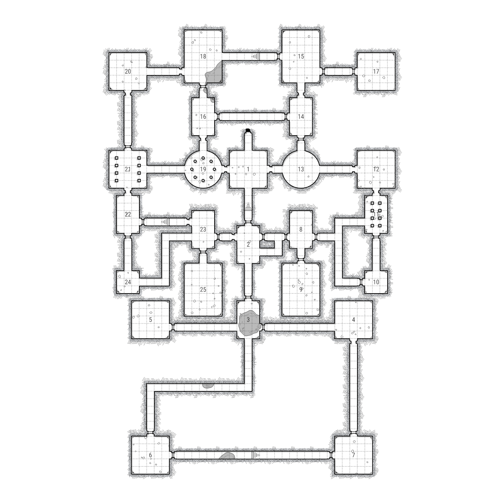
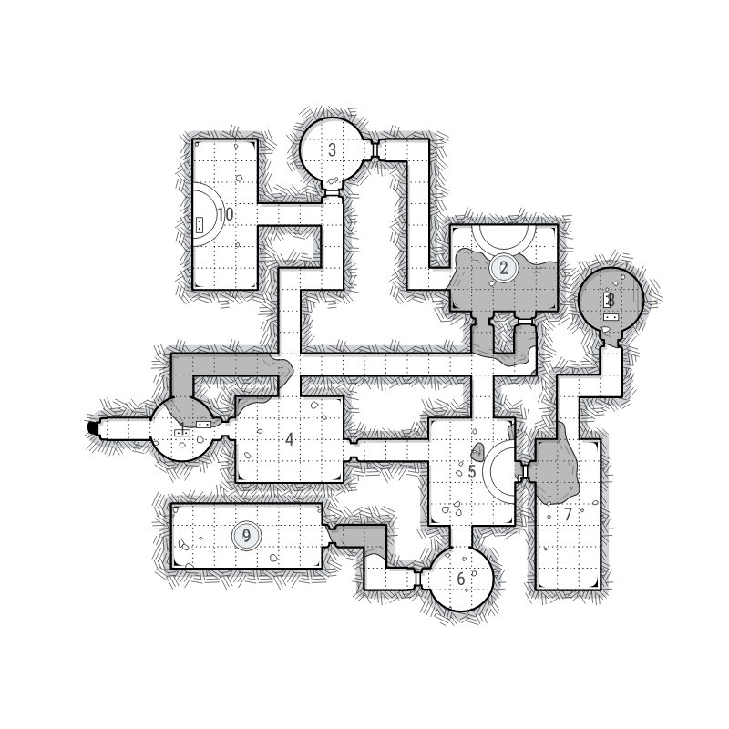

# Dungeongen

A procedural dungeon generation and rendering system for tabletop RPG maps.



## Features

### Layout Generation
- **Procedural room placement** with configurable room sizes and shapes (rectangular, circular)
- **Intelligent passage routing** that connects rooms with hallways
- **Multiple symmetry modes**: None, Bilateral (mirror), Radial-2, Radial-4
- **Dungeon archetypes**: Classic, Warren, Temple, Crypt, Lair
- **Configurable density**: Sparse, Normal, Tight packing
- **Automatic door placement** with open/closed states
- **Stairs and dungeon exits**

### Rendering
- **Hand-drawn aesthetic** with crosshatch shading and organic lines
- **Water features** with procedural shorelines and ripple effects
- **Room decorations**: columns, altars, fountains, dais platforms, rocks
- **High-quality SVG and PNG output**
- **Grid overlay** for tabletop play

### Water System
Procedural water generation using noise-based field generation:
- **Depth levels**: Dry, Puddles, Pools, Lakes, Flooded
- **Organic shorelines** using marching squares with Chaikin smoothing
- **Ripple effects** that follow contour curves



## Project Structure

```
dungeongen/
├── layout/          # Dungeon layout generation
│   ├── generator.py # Main procedural generator
│   ├── models.py    # Room, Passage, Door data models
│   ├── params.py    # Generation parameters
│   └── validator.py # Layout validation
│
├── map/             # Map rendering system
│   ├── map.py       # Main renderer
│   ├── room.py      # Room rendering
│   ├── passage.py   # Passage rendering
│   ├── water_layer.py # Water generation
│   └── _props/      # Decorations (columns, altars, etc.)
│
├── drawing/         # Drawing utilities
│   ├── crosshatch.py    # Crosshatch shading
│   └── water.py         # Water rendering
│
├── algorithms/      # Generic algorithms
│   ├── marching_squares.py  # Contour extraction
│   ├── chaikin.py          # Curve smoothing
│   └── poisson.py          # Poisson disk sampling
│
├── graphics/        # Graphics utilities
│   ├── noise.py     # Perlin noise, FBM
│   └── shapes.py    # Shape primitives
│
└── webview/         # Interactive web preview
    ├── app.py       # Flask application
    └── templates/   # HTML templates
```

## Installation

```bash
# Clone the repository
git clone https://github.com/yourusername/dungeongen.git
cd dungeongen

# Install dependencies
pip install -r requirements.txt
```

### Dependencies
- Python 3.10+
- skia-python (rendering)
- numpy (noise generation)
- opensimplex (Simplex noise)
- Flask (web preview)

## Usage

### Web Preview
```bash
python -m webview.app
```
Then open http://localhost:5050 in your browser.

### Python API
```python
from layout import DungeonGenerator, GenerationParams, DungeonSize, SymmetryType
from webview.adapter import convert_dungeon
from map.water_layer import WaterDepth
import skia

# Configure generation
params = GenerationParams()
params.size = DungeonSize.MEDIUM
params.symmetry = SymmetryType.BILATERAL

# Generate layout
generator = DungeonGenerator(params)
dungeon = generator.generate(seed=42)

# Convert to renderable map with water
dungeon_map = convert_dungeon(dungeon, water_depth=WaterDepth.POOLS)

# Render to PNG
width, height = 1200, 1200
surface = skia.Surface(width, height)
canvas = surface.getCanvas()
canvas.clear(skia.Color(255, 255, 255))

transform = dungeon_map._calculate_default_transform(width, height)
dungeon_map.render(canvas, transform)

image = surface.makeImageSnapshot()
image.save('my_dungeon.png', skia.kPNG)
```

## Configuration Options

### Dungeon Size
- `TINY` - 4-6 rooms
- `SMALL` - 6-10 rooms  
- `MEDIUM` - 10-20 rooms
- `LARGE` - 20-35 rooms
- `XLARGE` - 35-50 rooms

### Symmetry Types
- `NONE` - Asymmetric layout
- `BILATERAL` - Mirror symmetry (left/right)
- `RADIAL_2` - 180° rotational symmetry
- `RADIAL_4` - 90° rotational symmetry (4-fold)

### Water Depth
- `DRY` - No water
- `PUDDLES` - ~45% coverage
- `POOLS` - ~65% coverage
- `LAKES` - ~82% coverage
- `FLOODED` - ~90% coverage

## License

MIT License - See LICENSE file for details.
